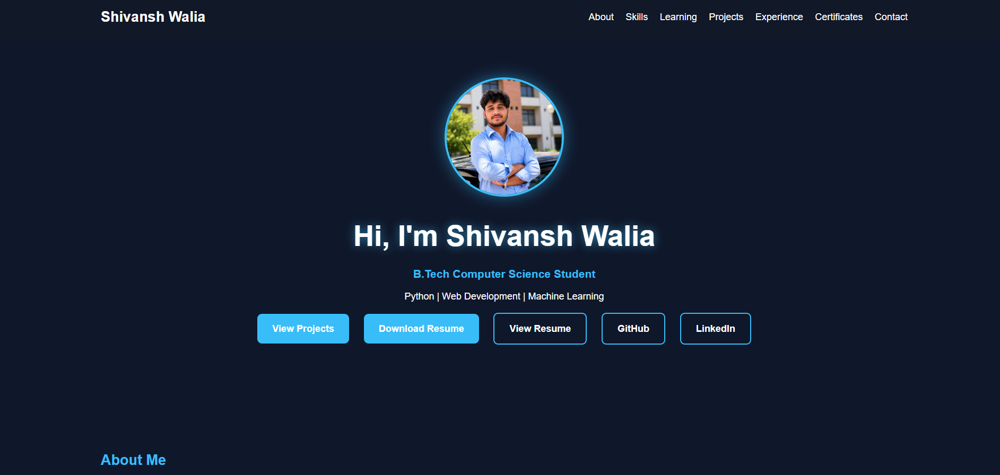

# 👨‍💻 Shivansh Walia - Personal Portfolio


A modern, responsive personal portfolio website showcasing my projects, technical skills, certifications, internship experience, and resume.

> This portfolio highlights my journey as a Computer Science student, featuring web development projects, machine learning applications, certifications, internship experience, and continuous learning in software engineering.

---

## 🌐 Live Website

🔗 https://shivanshwalia-001.github.io/shivansh-portfolio/
---
## 📸 Portfolio Preview



> **Note:** Replace this image with a full screenshot of your portfolio homepage for the best presentation.

## 📌 Features

- 👨‍💻 Professional portfolio website
- 📱 Fully responsive design
- 🚀 Featured projects section
- 💼 Internship experience
- 📜 Certifications
- 📄 Resume download
- 🌙 Modern UI
- 🔗 GitHub & LinkedIn integration

---
- 🌐 Live Portfolio Website
- 🚀 6 Featured Projects
- 📱 Fully Responsive
- 📄 Downloadable Resume
- 💻 GitHub Integration
- 🔗 LinkedIn Integration
---

## 🛠️ Built With

- HTML5
- CSS3
- JavaScript
- Responsive Design
- Git
- GitHub
- GitHub Pages
- VS Code
---

# 🚀 Featured Projects

## 🏆 Featured Project — TaskFlow
Modern responsive task management dashboard featuring:

...

A responsive task management dashboard featuring:

- Task creation, editing and deletion
- Priority management
- Due-date tracking
- Overdue detection
- Search & Filters
- Progress Dashboard
- Local Storage
- Responsive Design

### 🔗 Live Demo

https://shivanshwalia-001.github.io/TaskFlow/

### 💻 GitHub Repository

https://github.com/shivanshwalia-001/TaskFlow

---

## 🌦️ Weather App

A responsive weather application built using JavaScript and Weather API.

### Live Demo

https://shivanshwalia-001.github.io/weather-app/

### GitHub

https://github.com/shivanshwalia-001/weather-app

---

## 🏠 House Price Prediction

Machine Learning project using:

- Python
- Pandas
- NumPy
- Scikit-Learn

---

## 🏋️ Gym Management Website

Responsive frontend project developed using HTML, CSS and JavaScript.

---

## 🕒 Analog Watch

Real-time analog clock built using HTML, CSS and JavaScript.
---

# 📂 Project Structure

```text
shivansh-portfolio/
│
├── images/
│   ├── profile.jpg.png
│   └── taskflow.png
│
├── index.html
├── style.css
├── script.js
├── shivansh resume 1.pdf
├── LICENSE
└── README.md
```

The project follows a clean and organized folder structure, making it easy to maintain and extend.
---

# 📬 Contact

**Shivansh Walia**

📧 Email: shivanshwalia789@gmail.com

💻 GitHub: https://github.com/shivanshwalia-001

🔗 LinkedIn: https://www.linkedin.com/in/shivansh-walia/

🌐 Portfolio: https://shivanshwalia-001.github.io/shivansh-portfolio/

---

# 📄 License

This portfolio is released under the MIT License. Feel free to explore the source code and use it for learning purposes.